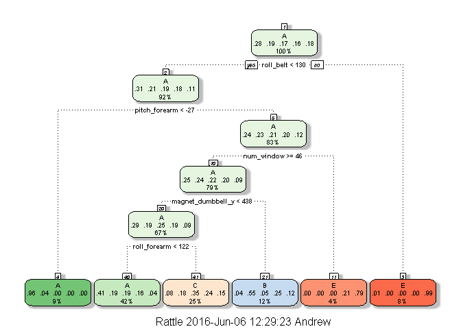
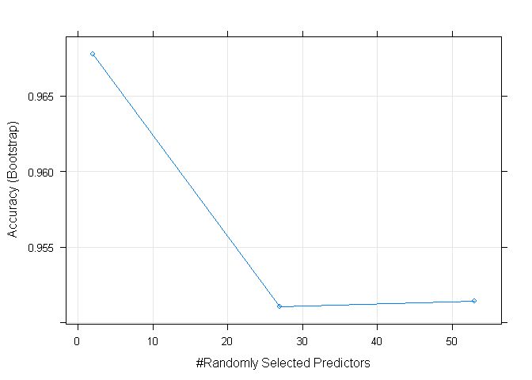

ML Course Project
================
Andrew Strasman
June 5, 2016

Machine Learning Course Project
===============================

Andrew Strasman
===============

Background
==========

Using devices such as Jawbone Up, Nike FuelBand, and Fitbit it is now possible to collect a large amount of data about personal activity relatively inexpensively. These type of devices are part of the quantified self movement - a group of enthusiasts who take measurements about themselves regularly to improve their health, to find patterns in their behavior, or because they are tech geeks. One thing that people regularly do is quantify how much of a particular activity they do, but they rarely quantify how well they do it. In this project, your goal will be to use data from accelerometers on the belt, forearm, arm, and dumbell of 6 participants. They were asked to perform barbell lifts correctly and incorrectly in 5 different ways. More information is available from the website here: <http://groupware.les.inf.puc-rio.br/har> (see the section on the Weight Lifting Exercise Dataset).

``` r
library(rattle)
```

    ## Rattle: A free graphical interface for data mining with R.
    ## Version 4.1.0 Copyright (c) 2006-2015 Togaware Pty Ltd.
    ## Type 'rattle()' to shake, rattle, and roll your data.

``` r
library(caret)
```

    ## Loading required package: lattice

    ## Loading required package: ggplot2

### Data

(just saving locally for simplicity and since nobody else will be running this)

``` r
download.file("http://d396qusza40orc.cloudfront.net/predmachlearn/pml-training.csv",
              destfile = "c://ML//pml-training.csv")

download.file("http://d396qusza40orc.cloudfront.net/predmachlearn/pml-testing.csv", 
              destfile = "c://ML//pml-testing.csv")
```

### Load the datasets

``` r
orig.training <- read.csv("c://ML//pml-training.csv", header=TRUE, na.strings = c("NA",""))
orig.testing <- read.csv("c://ML//pml-testing.csv", header=TRUE, na.strings = c("NA",""))
```

### Prepare the data

### 1/ Dump the dead weight

``` r
orig.training <- orig.training[,colSums(is.na(orig.training)) == 0]
orig.testing <- orig.testing[,colSums(is.na(orig.testing)) == 0]
```

### 2/ Remove unnecessary columns

``` r
orig.training <- orig.training[,-c(1:6)]
orig.testing <- orig.testing[,-c(1:6)]
```

### 3/ Partition the data for testing/validation

``` r
inTrain <- createDataPartition(orig.training$classe, p = 3/4, list=FALSE)
training <- orig.training[ inTrain, ]
testing <- orig.training[-inTrain, ]
```

Models
======

It's not that we are lazy; we are smart. Right from the paper "Qualitative Activity Recognition of Weight Lifting Exercises" we are told that they used 17 Principal Components and Random Forest for their modeling. Great, mission accomplished! We can essentially recreate their experiment with ease, which is nice but not overly rewarding.

Let's investigate first with another model to understand a little further of what constitutes "correct form".

### Tree-based with RPART

``` r
modelFit1 <- train(classe ~.,method="rpart",data=training)
```

    ## Loading required package: rpart

``` r
fancyRpartPlot(modelFit1$finalModel)
```

<!-- -->

``` r
cm1 <- confusionMatrix(testing$classe,predict(modelFit1,testing))
cm1$table
```

    ##           Reference
    ## Prediction    A    B    C    D    E
    ##          A 1281   22   89    0    3
    ##          B  390  331  228    0    0
    ##          C  392   27  436    0    0
    ##          D  344  156  272    0   32
    ##          E  100   74  182    0  545

Only 0.56 accurate !

``` r
acc1 <- postResample(testing$classe,predict(modelFit1,testing))
acc1
```

    ##  Accuracy     Kappa 
    ## 0.5287520 0.3846868

Let's use Random Forest and preProces with Principal Components Analysis. This should get us there.

### Using RF and PCA

``` r
modelFit2 <- train(training$classe ~ ., method="rf", preProcess="pca", data=training)
```

    ## Loading required package: randomForest

    ## randomForest 4.6-12

    ## Type rfNews() to see new features/changes/bug fixes.

    ## 
    ## Attaching package: 'randomForest'

    ## The following object is masked from 'package:ggplot2':
    ## 
    ##     margin

    ## Warning in randomForest.default(x, y, mtry = param$mtry, ...): invalid
    ## mtry: reset to within valid range

    ## Warning in randomForest.default(x, y, mtry = param$mtry, ...): invalid
    ## mtry: reset to within valid range

    ## Warning in randomForest.default(x, y, mtry = param$mtry, ...): invalid
    ## mtry: reset to within valid range

    ## Warning in randomForest.default(x, y, mtry = param$mtry, ...): invalid
    ## mtry: reset to within valid range

    ## Warning in randomForest.default(x, y, mtry = param$mtry, ...): invalid
    ## mtry: reset to within valid range

    ## Warning in randomForest.default(x, y, mtry = param$mtry, ...): invalid
    ## mtry: reset to within valid range

    ## Warning in randomForest.default(x, y, mtry = param$mtry, ...): invalid
    ## mtry: reset to within valid range

    ## Warning in randomForest.default(x, y, mtry = param$mtry, ...): invalid
    ## mtry: reset to within valid range

    ## Warning in randomForest.default(x, y, mtry = param$mtry, ...): invalid
    ## mtry: reset to within valid range

    ## Warning in randomForest.default(x, y, mtry = param$mtry, ...): invalid
    ## mtry: reset to within valid range

    ## Warning in randomForest.default(x, y, mtry = param$mtry, ...): invalid
    ## mtry: reset to within valid range

    ## Warning in randomForest.default(x, y, mtry = param$mtry, ...): invalid
    ## mtry: reset to within valid range

    ## Warning in randomForest.default(x, y, mtry = param$mtry, ...): invalid
    ## mtry: reset to within valid range

    ## Warning in randomForest.default(x, y, mtry = param$mtry, ...): invalid
    ## mtry: reset to within valid range

    ## Warning in randomForest.default(x, y, mtry = param$mtry, ...): invalid
    ## mtry: reset to within valid range

    ## Warning in randomForest.default(x, y, mtry = param$mtry, ...): invalid
    ## mtry: reset to within valid range

    ## Warning in randomForest.default(x, y, mtry = param$mtry, ...): invalid
    ## mtry: reset to within valid range

    ## Warning in randomForest.default(x, y, mtry = param$mtry, ...): invalid
    ## mtry: reset to within valid range

    ## Warning in randomForest.default(x, y, mtry = param$mtry, ...): invalid
    ## mtry: reset to within valid range

    ## Warning in randomForest.default(x, y, mtry = param$mtry, ...): invalid
    ## mtry: reset to within valid range

    ## Warning in randomForest.default(x, y, mtry = param$mtry, ...): invalid
    ## mtry: reset to within valid range

    ## Warning in randomForest.default(x, y, mtry = param$mtry, ...): invalid
    ## mtry: reset to within valid range

    ## Warning in randomForest.default(x, y, mtry = param$mtry, ...): invalid
    ## mtry: reset to within valid range

    ## Warning in randomForest.default(x, y, mtry = param$mtry, ...): invalid
    ## mtry: reset to within valid range

    ## Warning in randomForest.default(x, y, mtry = param$mtry, ...): invalid
    ## mtry: reset to within valid range

    ## Warning in randomForest.default(x, y, mtry = param$mtry, ...): invalid
    ## mtry: reset to within valid range

    ## Warning in randomForest.default(x, y, mtry = param$mtry, ...): invalid
    ## mtry: reset to within valid range

    ## Warning in randomForest.default(x, y, mtry = param$mtry, ...): invalid
    ## mtry: reset to within valid range

    ## Warning in randomForest.default(x, y, mtry = param$mtry, ...): invalid
    ## mtry: reset to within valid range

    ## Warning in randomForest.default(x, y, mtry = param$mtry, ...): invalid
    ## mtry: reset to within valid range

    ## Warning in randomForest.default(x, y, mtry = param$mtry, ...): invalid
    ## mtry: reset to within valid range

    ## Warning in randomForest.default(x, y, mtry = param$mtry, ...): invalid
    ## mtry: reset to within valid range

    ## Warning in randomForest.default(x, y, mtry = param$mtry, ...): invalid
    ## mtry: reset to within valid range

    ## Warning in randomForest.default(x, y, mtry = param$mtry, ...): invalid
    ## mtry: reset to within valid range

    ## Warning in randomForest.default(x, y, mtry = param$mtry, ...): invalid
    ## mtry: reset to within valid range

    ## Warning in randomForest.default(x, y, mtry = param$mtry, ...): invalid
    ## mtry: reset to within valid range

    ## Warning in randomForest.default(x, y, mtry = param$mtry, ...): invalid
    ## mtry: reset to within valid range

``` r
modelFit2$results
```

    ##   mtry  Accuracy     Kappa  AccuracySD     KappaSD
    ## 1    2 0.9677502 0.9592099 0.003256930 0.004119923
    ## 2   27 0.9510841 0.9381391 0.006180674 0.007798662
    ## 3   53 0.9514472 0.9385969 0.005864519 0.007398128

``` r
plot(modelFit2, metric="Accuracy")
```

<!-- -->

### Predict on validation set

``` r
cm2 <- confusionMatrix(testing$classe,predict(modelFit2,testing))
cm2$table
```

    ##           Reference
    ## Prediction    A    B    C    D    E
    ##          A 1386    4    1    1    3
    ##          B    8  925   13    0    3
    ##          C    6    9  830    8    2
    ##          D    0    3   24  777    0
    ##          E    0    4    1    7  889

### Compute accuracy

``` r
acc2 <- postResample(testing$classe,predict(modelFit2,testing))
acc2
```

    ##  Accuracy     Kappa 
    ## 0.9802202 0.9749778

much better!

### Quiz testing data and results

``` r
quiz <- predict(modelFit2, orig.testing)
quiz
```

    ##  [1] B A A A A E D B A A B C B A E E A B B B
    ## Levels: A B C D E
